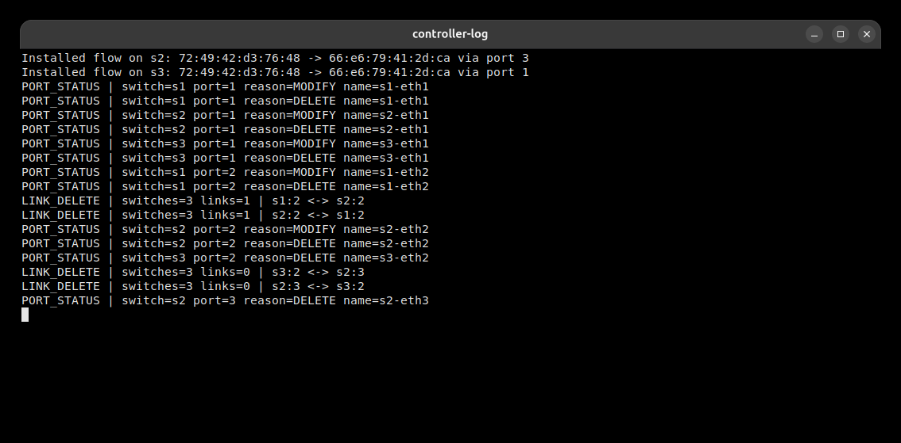
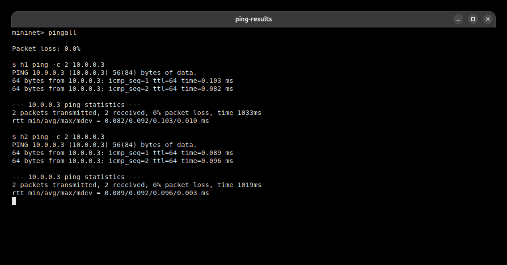
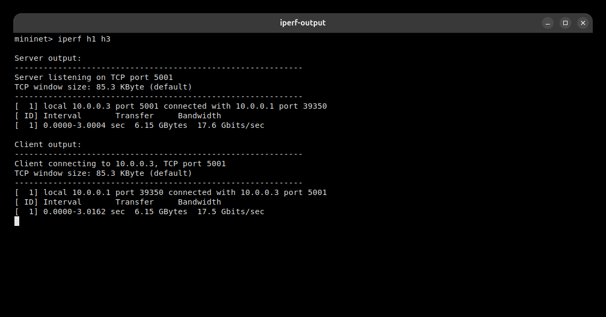
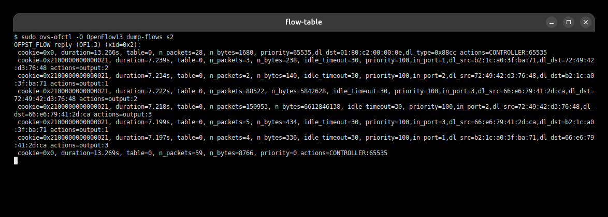
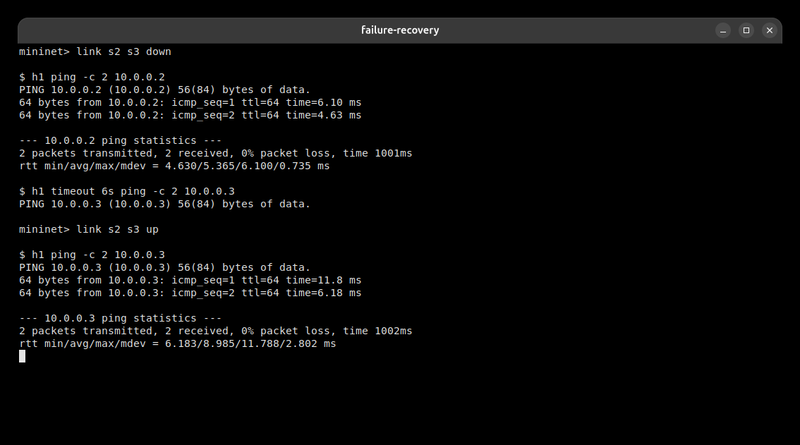

# Topic 21 - Topology Change Detector

## Problem Statement

Implement a topology change detector using Mininet and a Ryu controller. The controller should detect switch and link changes, handle `packet_in`, and install OpenFlow flow rules.

## Files

- `detector.py` - Ryu controller
- `dynamic_topo.py` - Mininet topology

## Requirements

```bash
sudo apt-get update
sudo apt-get install -y mininet openvswitch-switch tshark python3-venv iperf
python3 -m venv .venv
source .venv/bin/activate
pip install eventlet msgpack netaddr oslo.config ovs packaging routes six tinyrpc webob
git clone https://github.com/faucetsdn/ryu .vendor/ryu-src
```

## Run

Terminal 1:

```bash
source .venv/bin/activate
PYTHONPATH=.vendor/ryu-src python -m ryu.cmd.manager --observe-links detector.py
```

Terminal 2:

```bash
sudo mn --custom dynamic_topo.py --topo topic21 --mac --switch ovsk,protocols=OpenFlow13 --controller remote,ip=127.0.0.1,port=6653
```

## Commands Used

```text
pingall
iperf h1 h3
sudo ovs-ofctl -O OpenFlow13 dump-flows s2
link s2 s3 down
h1 ping -c 2 h3
link s2 s3 up
h1 ping -c 2 h3
```

## Expected Output

- `pingall` should work in the normal case.
- `iperf h1 h3` should show throughput.
- Flow rules should appear in `ovs-ofctl`.
- After `link s2 s3 down`, `h1` to `h3` should fail.
- After `link s2 s3 up`, `h1` to `h3` should work again.

## Screenshots

### Controller log



### Ping result



### Iperf result



### Flow table



### Failure and recovery



## References

- https://mininet.org/overview/
- https://mininet.org/walkthrough/
- https://github.com/faucetsdn/ryu
